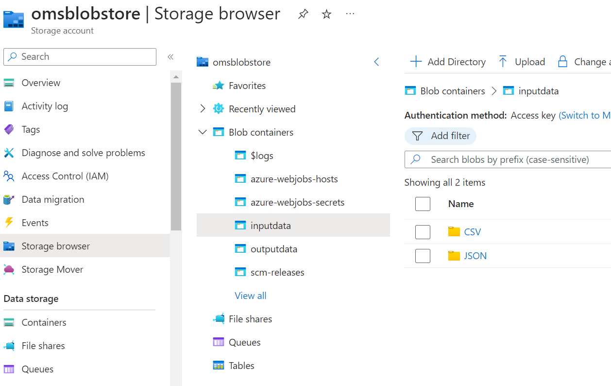
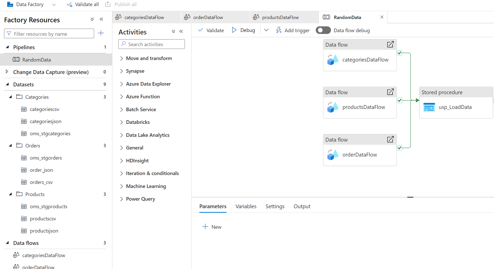
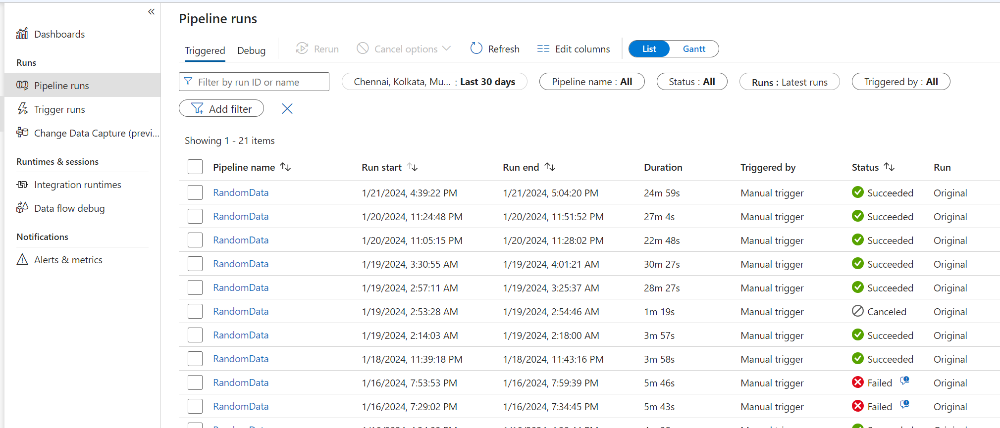
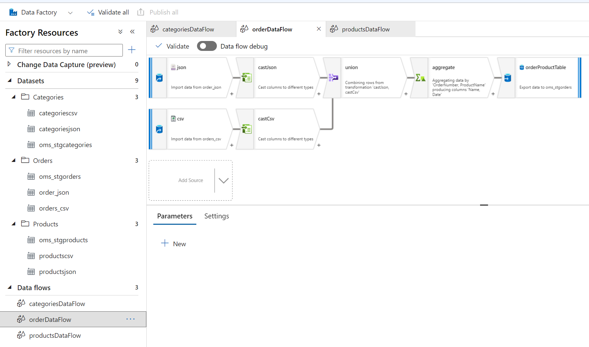
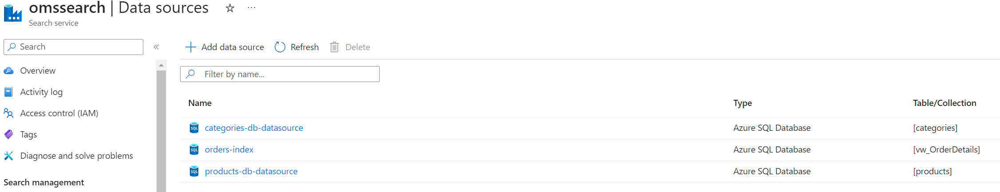
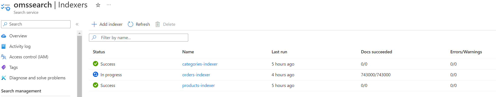
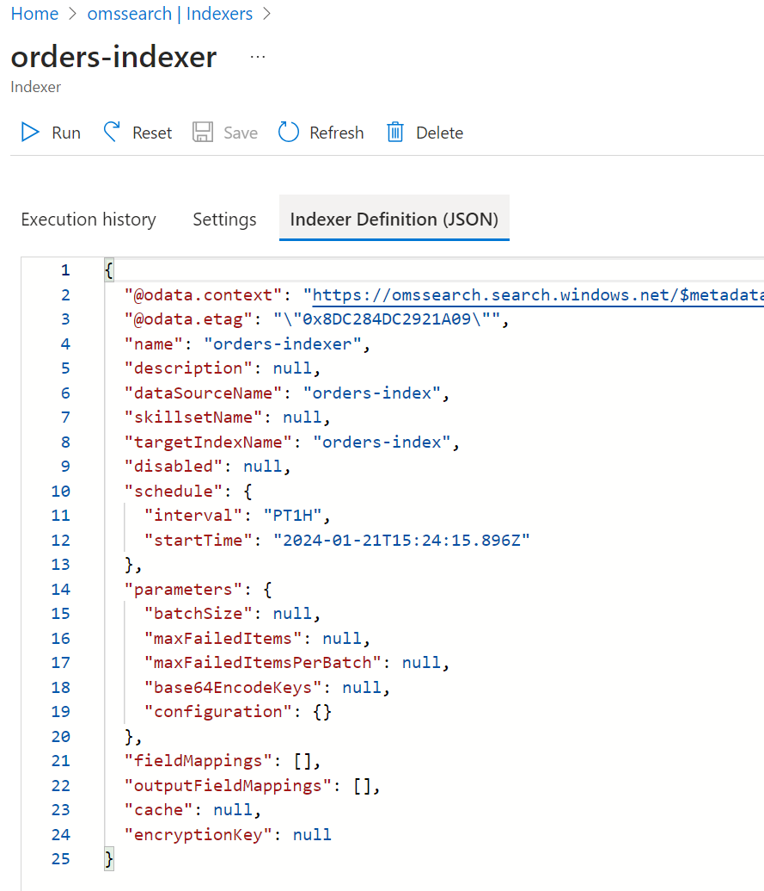
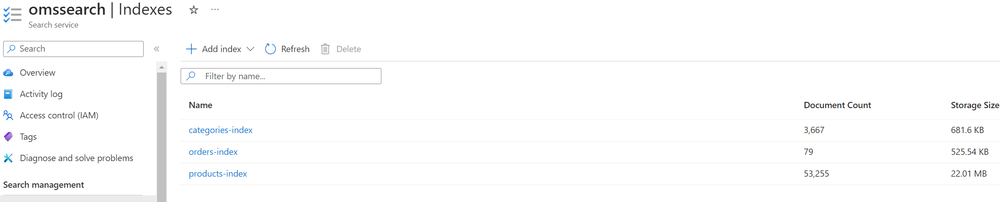
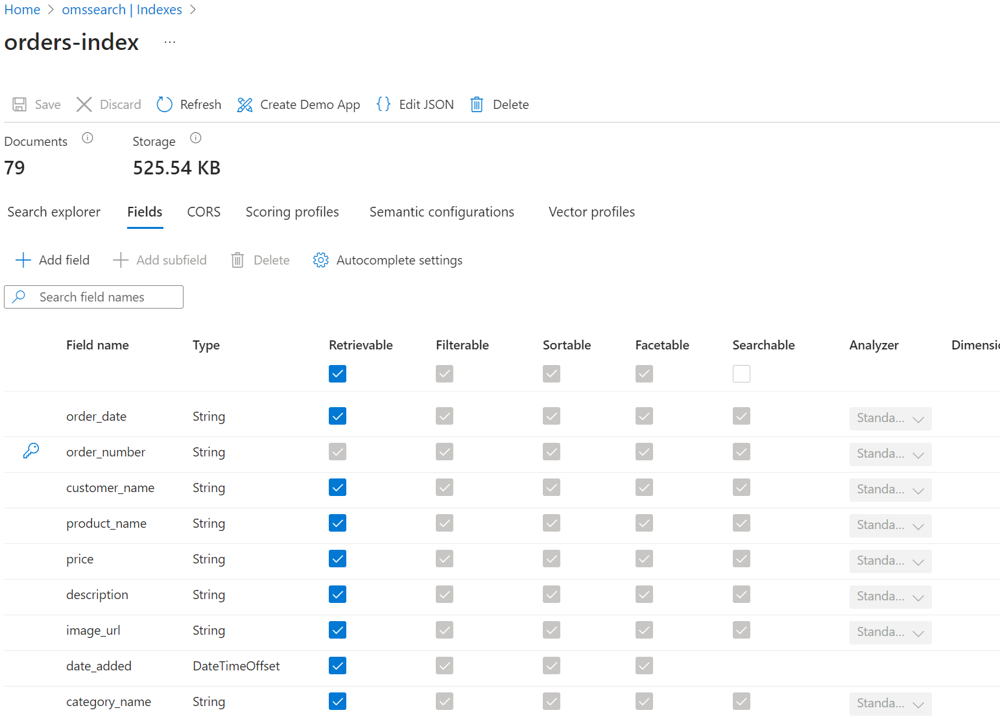

# Screenshots of integration

#### Blob storage reflecting files genearted and uploaded into blob

Blob storage

### ADF pipeline related screenshots

Pipeline

Monitoring

Data flow

### Cognitive Search
Data Sources - Connection to the physical data source

Indexer - This looks into your data source to fetch new/updated records to refresh the index

Indexer definition - This looks into your data source to fetch new/updated records to refresh the index

Index 

Index definition - Indexing criteria

