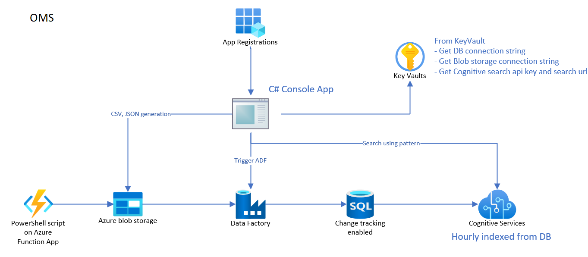

# ADF, Azure Cognitive Search Integration using C#
This is a console application which integrates ADF pipeline using C# console application. Using this console application, we can trigger ADF pipeline, monitor it and also perform a cognitive search on data being ingested. 

## High level design


Upon running the application, this is how the menu would look like

Order Management System Menu
1. Generate random data and trigger ADF pipeline
2. Monitor ADF Pipeline
3. Search
4. Exit

### Console logs when data generation(1) is selected:
```
Enter your choice (1-4): 1
MaxCategories: 1000, MaxProducts: 50000, MaxOrders: 250000
Generated 0 of 1000 categories
Generated 100 of 1000 categories
...
CSV creation completed for categories
Generated 0 of 50000 products
Generated 5000 of 50000 products
...
``````

### Console logs when monitoring(2) is selected: 
```
Enter your choice (1-4): 2
Reading datafactory: omsadf-learning
Get an existing resource group oms...
Get Data Factory omsadf-learning...
Checking pipeline $RandomData run status...
Status: InProgress
Sleeping for 15 seconds,  pipeline status InProgress
```


## Setup

Create following infrastructure on Azure
1. Azure SQL database - Execute [Database setup script](dbscripts/omsdb.sql)
2. Data factory
3. Key Vault
4. Application registration

Once infrastructure is ready,
build and execute C# project - [OmsCli](OmsCli/OmsCli.sln)
This project has excluded few important configuration files
- App.config
- Settings.settings 


Build
> dotnet build .\OmsCli\

Run
> dotnet run  --project .\OmsCli\OmsCli\