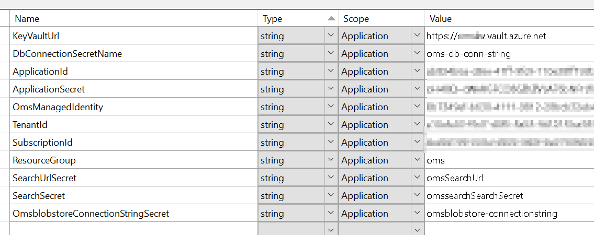

# ADF, Azure Cognitive Search Integration using C#
This is a console application which integrates ADF pipeline using C# console application. Using this console application, we can trigger ADF pipeline, monitor it and also perform a cognitive search on data being ingested. 

## High level design


This application can be started in either of the two modes.
i.e. 
1. CLI mode
2. Console UI

### CLI Mode

In order to launch an application, navigate to the directory where `sln` file is present i.e. `.\OmsCli`
Build the solution using 
> dotnet build [.\OmsCli](./OmsCli/)

Once build is successful, you can run the application using `dotnet run` i.e.
Please make sure you are either into the `csproj` directory or use correct path in project parameter

> dotnet run --project [.\OmsCli\OmsCli](./OmsCli/OmsCli/)

In CLI mode, I have exposed 5 commands
i.e.
- `generate` 
- `trigger`
- `monitor`
- `search`
- `exit`

[`generate`](./OmsCli/OmsCli/AzureManager/DataGenerator.cs) command accepts 1 optional parameter(seed) i.e. default value is set to 1000. This will generate 1000 categories, 50k products and 250k orders in csv and same numbers in json.
In total if pipeline is triggered, it will push 2k records in category, 100k in products and 500k in orders(order product map) table

> dotnet run --project [.\OmsCli\OmsCli](./OmsCli/OmsCli/) generate 100

[`trigger`](./OmsCli/OmsCli/AzureManager/AdfManager.cs) command executes the pipeline. Given with generate command, files generated will be uploaded to blob storage. This pipeline is configured to read the files uploaded in the same storage account. This pipeline reads both of the files, perform union, deduplication and inserts into staging tables. This command takes an optional parameter as pipeline name. This command assumes you have data factory name `omsadf-learning` as hardcoded in [AdfManager.cs](./OmsCli/OmsCli/AzureManager/AdfManager.cs)

> dotnet run --project [.\OmsCli\OmsCli](./OmsCli/OmsCli/) trigger pipelineName

Just a note, if this command executes successfully, it will print a guid which is a `RunId` for a pipeline. This will be used as an input for `monitor`.

`monitor` This command is used to monitor the pipeline running status. It takes 2 optional parameters as input i.e. 

> dotnet run --project [.\OmsCli\OmsCli](./OmsCli/OmsCli/) monitor runId

[`search`](./OmsCli/OmsCli/AzureManager/SearchManager.cs) This command us used to perform a search operation on an indexed data. Index gets refreshed every hour. This takes an optional parameter as an input i.e. index name

> dotnet run --project [.\OmsCli\OmsCli](./OmsCli/OmsCli/) search indexName


`Menu` This command opens the same interface in a console mode as explained below in console mode.

> dotnet run --project [.\OmsCli\OmsCli](./OmsCli/OmsCli/) menu

### Console mode

Upon running the application, this is how the menu would look like

Order Management System Menu
1. Generate random data
2. Trigger ADF pipeline
3. Monitor ADF Pipeline
4. Search
5. Exit

### Console logs when data generation(1) is selected:
```
Enter your choice (1-4): 1
MaxCategories: 1000, MaxProducts: 50000, MaxOrders: 250000
Generated 0 of 1000 categories
Generated 100 of 1000 categories
...
CSV creation completed for categories
Generated 0 of 50000 products
Generated 5000 of 50000 products
...
``````

### Console logs when monitoring(2) is selected: 
```
Enter your choice (1-4): 2
Reading datafactory: omsadf-learning
Get an existing resource group oms...
Get Data Factory omsadf-learning...
Checking pipeline $RandomData run status...
Status: InProgress
Sleeping for 15 seconds,  pipeline status InProgress
```


## Setup

Create following infrastructure on Azure
1. Azure SQL database - Execute [Database setup script](dbscripts/omsdb.sql)
2. Data factory
    - Data flow for categories
    - Data flow for products
    - Data flow for orders
3. Key Vault
4. Application registration
5. Cognitive search

Once infrastructure is ready,
build and execute C# project - [OmsCli](OmsCli/OmsCli.sln)
This project has excluded few important configuration files
- App.config
- Settings.settings 

